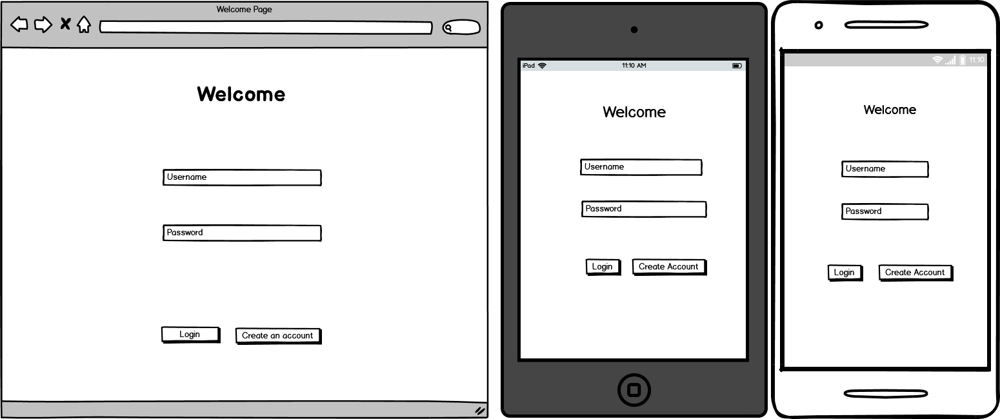
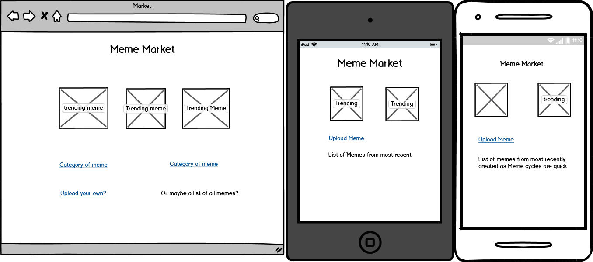
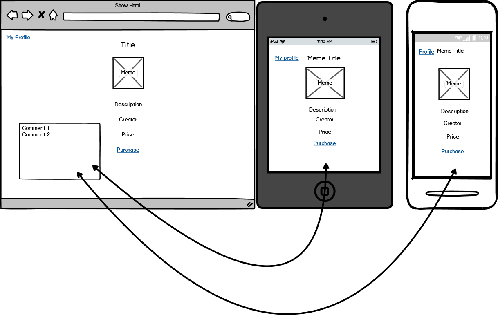
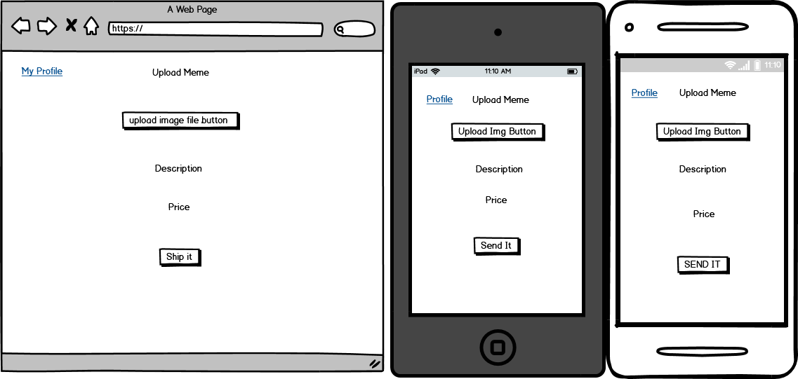
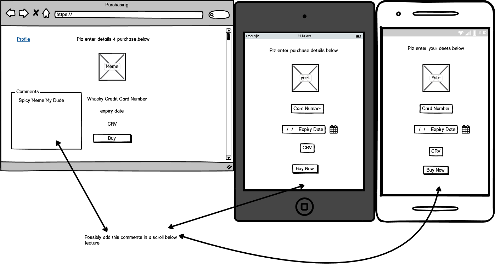
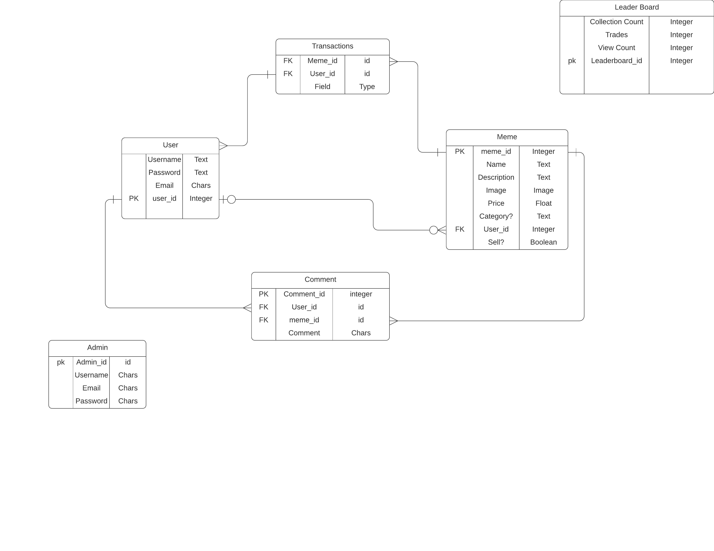

---

---

# AnthonyWilde_T2A2

R7. Identification of the *problem* you are trying to solve by building this particular marketplace *app*.**

My website is a meme marketplace, I am seeking to 'monetise' memes. "Just as genes propagate themselves in the gene pool by leaping from body to body via sperms or eggs, so **memes** propagate themselves in the **meme** pool by leaping from brain to brain via a process which, in the broad sense, can be called imitation" Richard Dawkins said this and I agree with him. However I think that the people out there who scroll through the thousands upon thousands of hours of content making our gifs and our meme templates are being taken advantage of for the good work that they do. 

**R8. Why is it a problem that needs solving?**

My marketplace is necessary as it will allow for the acceleration of the memes in the world by allowing meme creators to profit off of there memes. It also is a very market directed economic model. If a meme creator tries to sell there memes for too much then the market will not purchase. Most people viewing memes aren't going to want to pay to much for memes so if someone starts bumping up prices or the quality of their work decreases people will not wish to have their memes anymore. Mainly as stated above its to help generate jobs where people can just create content for a living where as they previously did the work for free.

**R11. Description of your marketplace *app* (website), including:**
**\- Purpose**
**\- Functionality / features**
**\- Sitemap**
**\- Screenshots**
**\- Target audience**
**\- Tech stack (e.g. html, css, deployment platform, etc)**

Purpose: My Purpose is that I seek to create a platform where people can trade memes with one another. I think this will help memes to progress but also allow people to profit from their creation.

Functionality/ Features: My Website will have the ability to buy and sell your memes that you own for your own prices! It will allow you to browse through other people's memes on the website. You will have a place that stores your Memes for you so you can look at them over time. You will be able to upload your own memes to the website that you can then choose to sell or add to your collection too. You will be able to comment on other peoples memes or profiles as your surf the website.

Target audience: My website has a target audience of anyone, however being realistic about the demographics probably the audience is young adolescent males and females. With some users in their early 20's as well.

Sitemap:

**R18. Discuss the database relations to be implemented.** 

My database has very few relations to keep the project simple and effective. There is 4 database tables in my design; **User**, **Meme**, **Transaction** and **Comment**.

User table: The User Table has 3 associations; A **One(Zero) to Many(Zero)** relation with the Meme Table (meaning that one user can own many memes but also a possible 0 memes), a **Many to One** relation with comments (many comments belong to one User). Finally a single user could have many transactions (A **one to many** association). Because of these parameters I would implement the User table into the database first as it has no dependencies, this will be important because it'll be easy to test whether it is working separately (if there is any problems later on with dependencies it'll be a good reference point). 

Meme: Memes as a class has a **many to one** relation with comments (many comments have one meme), also memes have a **one to many** with transactions (one meme has the potential of many transactions). I will make the Meme table, because it will be required that a User will make/ upload memes to the site so a Meme cannot exist without a User having creating it.

Transaction: I will create The Transaction Table 3rd as it is the more important that I have a working transaction table for the app and while comments are nice they aren't as necessary to the creation of my app as ensuring the transactions succeed. This table has **2 dependencies**, first the user/s that are used to require the transaction, and the Meme which is the Item being purchased. (This also allows for easier testing as you can test whether Users and Memes are working separately before testing Transactions).

Comment: Finally comments has already been stated as having the **relations** to Users and Memes, making them impossible to exist without both of these tables.

**R12. User Stories**

As a user I want to create an Account and log on to access the authorised parts of the website.

As A User I want to be able to view my profile so I can view all the memes I own.

As A User I want to be able to view my profile so I can update my profile information.

As A User I want to be able to edit the price or availability of a meme from my collection.

As A User i want to be able to add additional memes to my collection, with the potential of selling them. 

As A User I want to be able to add comments to other people's profile or Meme's (Or my own).

As A User I want to be able to view another persons meme.

As A User I want to be able to view another persons profile.

As A User I want to be able to buy another person's meme through the page I'm viewing the meme.

As A User I would like to be able to access my profile at any point.

As A User I want to be able to log out.

**R.13** **Wireframes**

**R.14 ERD**

DO THIS ONE AFTER FINISHING THE APP VVVVVVVVVVVVV

Describe your project's models in terms of relationships (active record associations) they have with each other.

I will have several models in this project, one for User's, one for Meme's and one for Comment's, First off my Users as stated above will be the only one of the models to now have any dependencies, the way it will work is that Users can have many comments or memes but a meme can only have one user or a comment can only have one User. This is necessary as to allow new users to access the site and allow their profile to exist without having any content. Because of this in the model it will have in the Active record **has_many: meme** and **has_many: comments**. My Meme model will have a dependency to the User model but will also itself have a many relationship with comments. It will appear like this; **belongs_to: User** and **has_many: Comments**. The model for Comments, as stated above will have to be created last, as it relies on to other model's and their data to exist as it exists as a way of these 2 other models to communicate effectively on the front end. The Comment Model will have 2 main active record associations **belongs_to: User** and **belongs_to: Comment**

