---

---

# AnthonyWilde_T2A2

**R7. Identification of the *problem* you are trying to solve by building this particular marketplace *app*.**

My website is a meme marketplace, I am seeking to 'monetise' memes. "Just as genes propagate themselves in the gene pool by leaping from body to body via sperms or eggs, so **memes** propagate themselves in the **meme** pool by leaping from brain to brain via a process which, in the broad sense, can be called imitation" Richard Dawkins said this and I agree with him. However I think that the people out there who scroll through the thousands upon thousands of hours of content making our gifs and our meme templates are being taken advantage of for the good work that they do. 

**R8. Why is it a problem that needs solving?**

My marketplace is necessary as it will allow for the acceleration of the memes in the world by allowing meme creators to profit off of there memes. It also is a very market directed economic model. If a meme creator tries to sell there memes for too much then the market will not purchase. Most people viewing memes aren't going to want to pay to much for memes so if someone starts bumping up prices or the quality of their work decreases people will not wish to have their memes anymore. Mainly as stated above its to help generate jobs where people can just create content for a living where as they previously did the work for free.

**R9. Link to the deployed app**
 
https://meme-market-6969.herokuapp.com/users/

**R10 A Link to your GitHub repo**

https://github.com/Anthonywilde1/AnthonyWilde_T2A2

**R11. Description of your marketplace *app* (website), including:**
**\- Purpose**
**\- Functionality / features**
**\- Sitemap**
**\- Screenshots**
**\- Target audience**
**\- Tech stack (e.g. html, css, deployment platform, etc)**

Purpose: My Purpose is that I seek to create a platform where people can trade memes with one another. I think this will help memes to progress but also allow people to profit from their creation.

Functionality/ Features: My Website will have the ability to buy and sell your memes that you own for your own prices! It will allow you to browse through other people's memes on the website. You will have a place that stores your Memes for you so you can look at them over time. You will be able to upload your own memes to the website that you can then choose to sell or add to your collection too. You will be able to comment on other peoples memes or profiles as your surf the website.

Target audience: My website has a target audience of anyone, however being realistic about the demographics probably the audience is young adolescent males and females. With some users in their early 20's as well.

Sitemap:

Tech stack
Ruby: The programming language used to primarily create the app through an application called **Rails**. Rails creates ERB pages which are embedded ruby html pages. Creating a hybrid of HTML and ruby commands to create a webpage.

Javascript: Javascript is used within just one small part of stripe. In the button created to send you to the Stripe secure link it is done in Javascript.

Stripe: An API that I used to create a payment platform for the memes. Stripe creates a button on pages you deem necessary of having said button which then links you to a secure webpage that allows you to put in credit card/ payment info and then redirects you to the website you were on.

AWS/ Amazon Web Services: Amazon Web Services is an API that allows your web app to communicate with Amazon Web Services to create online storage or 'cloud' storage for your web app. It allows you to hand off the storage of images/gifs/videos/etc rather then having it all within the application, making the website more bulky or eventually exceed data storage capacity. 

Devise: A gem that I used for authentication within my application, it allows for the creations of user via email and the encryption of passwords associated with those users.

**R12. User Stories**

User:

As a user I want to create an Account and log on to access the authorised parts of the website.

As A User I want to be able to view my profile so I can view all the memes I own.

As A User I want to be able to view my profile so I can update my profile information.

As A User I want to be able to add comments to other people's profile or Meme's (Or my own).

As A User I want to be able to view another persons meme.

As A User I want to be able to view another persons profile.

As A User I would like to be able to access my profile at any point.

As A User I want to be able to log out.

Artist/Seller:

As A User I want to be able to edit the price or availability of a meme from my collection.

As A User i want to be able to add additional memes to my collection, with the potential of selling them. 

As A User I want to be able to buy another person's meme through the page I'm viewing the meme.

**R.13** **Wireframes**

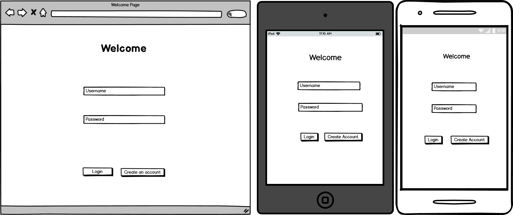

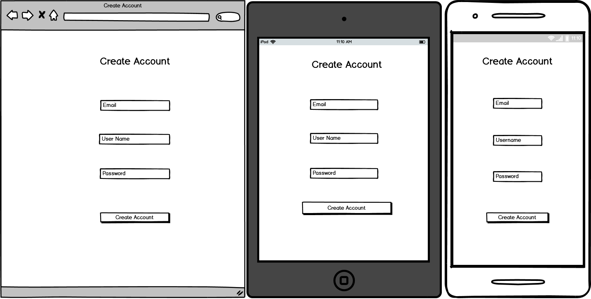

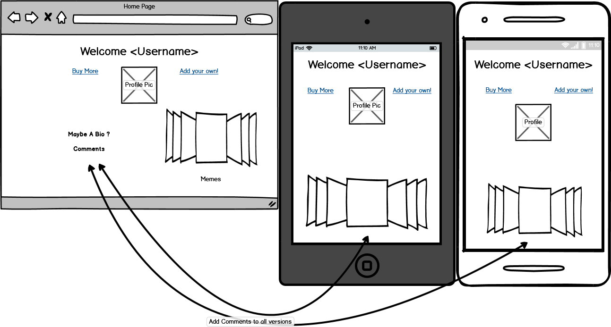

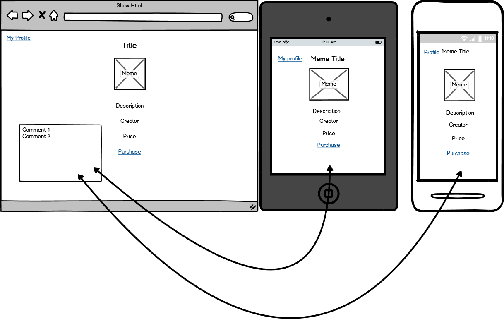

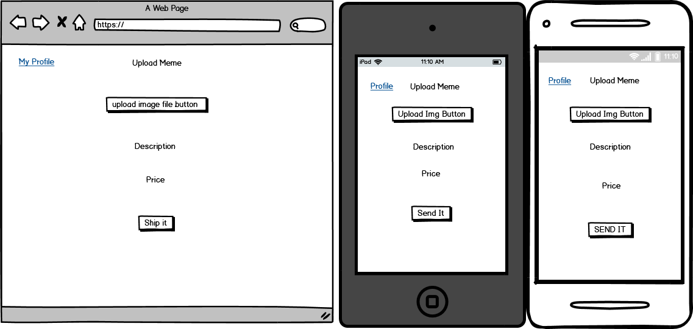

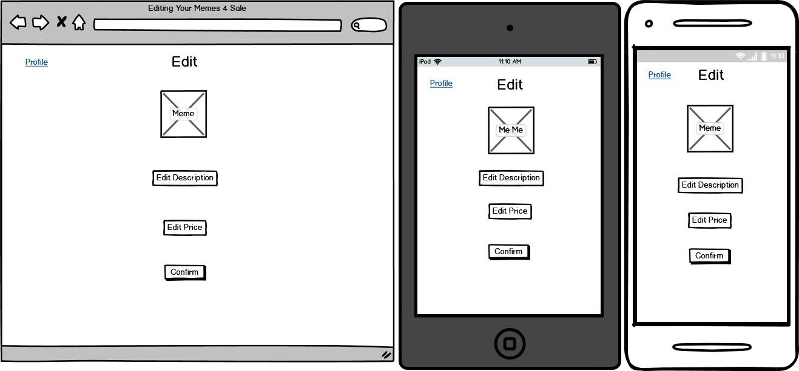

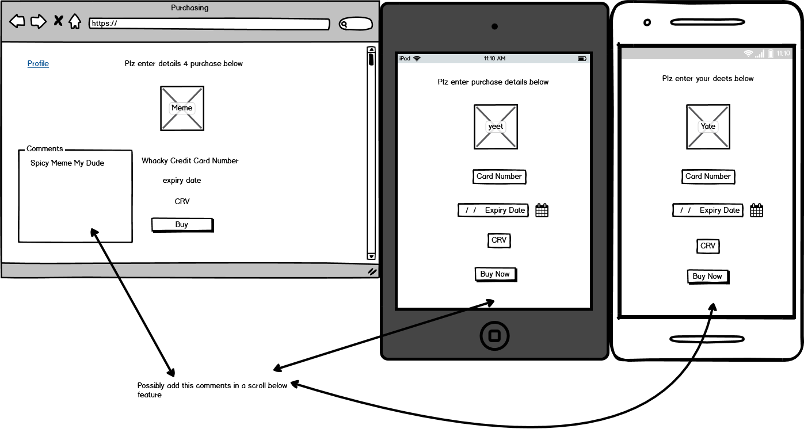

**R.14 ERD**

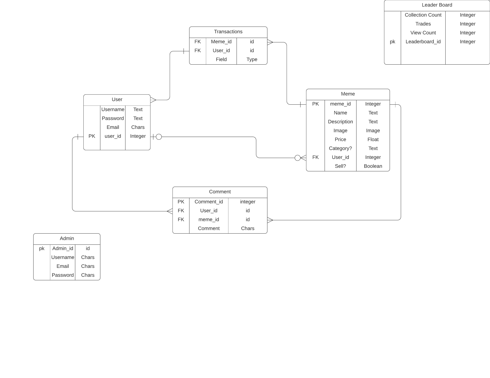
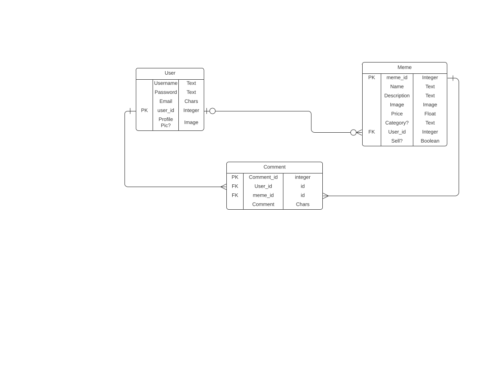

**R.15 Explain the different high-level components (abstractions) in your app**
The High level components in my app are the User and the Memes and the ability to purchase Memes. The User  will have the ability to generate memes as well as keep a collection for themselves. The user will also be able to buy other peoples Memes to add to their collection. The Memes are important as it is the commodity that is being traded on the website, without the Memes the Users would have no reason to be on my website. Finally the ability to purchase other peoples memes is also integral to the website, without the ability to purchase memes the websites main problem that it is intending to solve would be lost.

**R16 Detail any third party services that your app will use?**
Amazon Web Services s3 -  was used within this application as an online storage service for the images on my website, as my site continued to grow it would be impractical to continue to store pictures locally as it would very easiliy grow to an unmanageable level with the rails app. The Amazon Web Services allow you to create data storage on the "cloud" to store any pictures that a user uploads. Amazon S3 uses an API that allows a developer to get the storage cloud to communicate with their application to allow online storage. You can view all images uploaded
Stripe - Stripe requires a gem to use on rails. Stripe is an online secure payment api that allows you to create a payment system for your app, it allows for the creation of a link to a secure payment and processing site and then link back the site at hand. This payment api can be used in test environments aswell which is good to make sure everything is working before the final transfer to full on payments. Its also possible to track the payments done on your website through stripes website.

**R.17 Describe your project's models in terms of relationships (active record associations) they have with each other.**

In my original idea I had a project that had 4 models , with 2 additional models. My project as it stands today has 3 models. A **User's Model**, a **Meme's Model** and a **Comment Model**. My **User's Model** has a one to many relationship with the **Meme Model**, that is 1 **User** has many **Memes** . A **User** also has a one to many association with **comments**, one user has many comments. A **Meme model** has a one to many relationship with **Comments model** too. One meme can have many comments on it. Also a **Meme model** has a many to one relation with **Users** many memes can belong to one user. **Comments Model** has a many to one for both **Meme** and **User** model. I attempted to create a 'has_many :through' association through an additional model called "transactopn which is referenced in my sitemaps, however I did not have the time and the stripe gem takes over the responsiblities so it was pointless to enact a change. All models bar the first model **Users**  have a User_id Foreign key within them that is **null:false** meaning that all other models require a User_id within them to work effeciently. Additionally a comment requires a Meme_id and an User_id in order to be created. 

**R18. Discuss the database relations to be implemented.** 

My database has very few relations to keep the project simple and effective. There is 4 database tables in my design; **User**, **Meme**, **Transaction** and **Comment**.

User table: The User Table has 3 associations; A **One(Zero) to Many(Zero)** relation with the Meme Table (meaning that one user can own many memes but also a possible 0 memes), a **Many to One** relation with comments (many comments belong to one User). Finally a single user could have many transactions (A **one to many** association). Because of these parameters I would implement the User table into the database first as it has no dependencies, this will be important because it'll be easy to test whether it is working separately (if there is any problems later on with dependencies it'll be a good reference point). 

Meme: Memes as a class has a **many to one** relation with comments (many comments have one meme), also memes have a **one to many** with transactions (one meme has the potential of many transactions). I will make the Meme table, because it will be required that a User will make/ upload memes to the site so a Meme cannot exist without a User having creating it.

Transaction: I will create The Transaction Table 3rd as it is the more important that I have a working transaction table for the app and while comments are nice they aren't as necessary to the creation of my app as ensuring the transactions succeed. This table has **2 dependencies**, first the user/s that are used to require the transaction, and the Meme which is the Item being purchased. (This also allows for easier testing as you can test whether Users and Memes are working separately before testing Transactions).

Comment: Finally comments has already been stated as having the **relations** to Users and Memes, making them impossible to exist without both of these tables.

**R.19 Provide your database schema design**
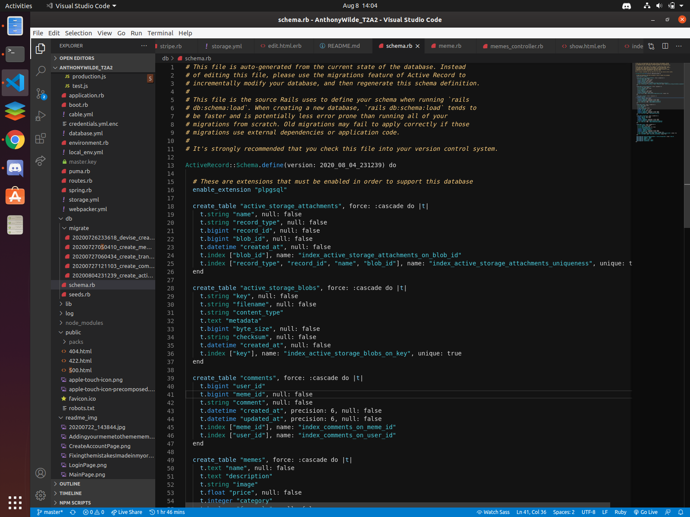
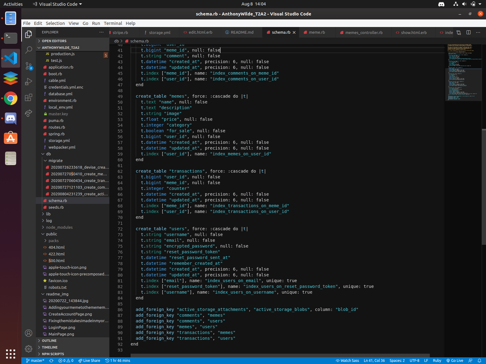

**R.20 Describe the way tasks are allocated and tracked in your project**
The tasks for my application were tracked using the Trello Board website, it allowed me to create small cards that I can give data such as; when they are due by and add them to list such as; urgent. The tasks were added to this board on Trello after reading through the T2A2 and evaluating what tasks would need to be done in which order and adding them to the trello board. Some of the tasks written in the T2A2 are required to do before others, such as the ERD's and the Wireframes's. Once these tasks were put into the Trello board i assigned them due dates based on when I thought based on the project how much time a project would need and a color label to display urgency. 
https://trello.com/b/PUm6sFyl/meme-marketplace
